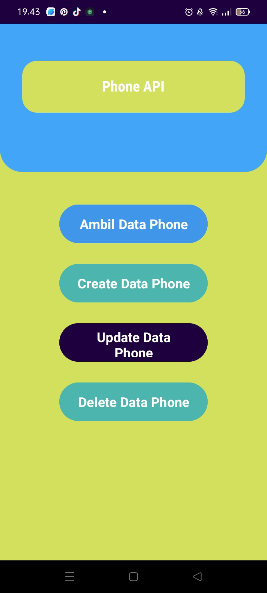
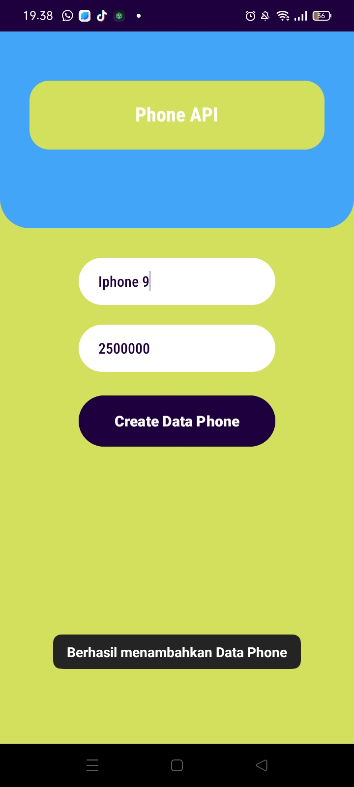
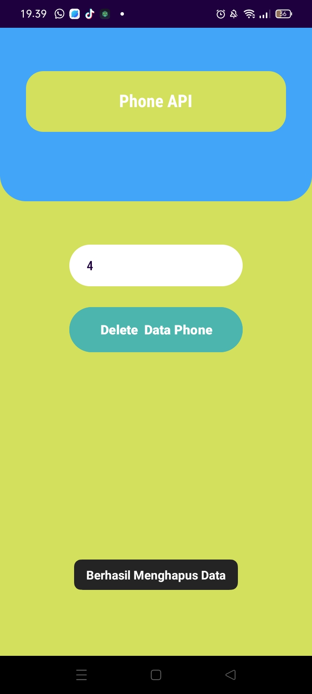
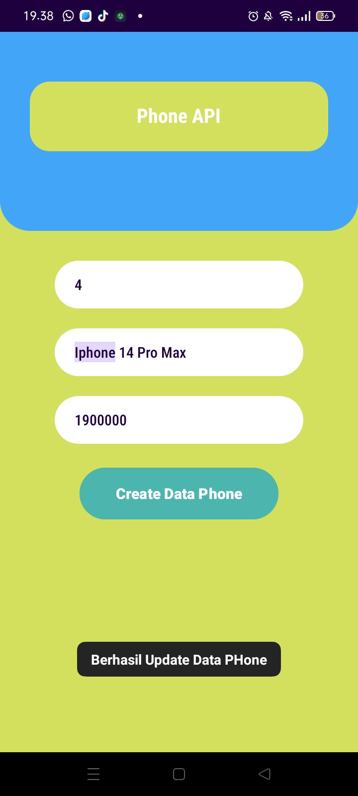
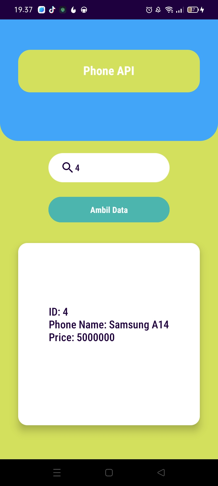
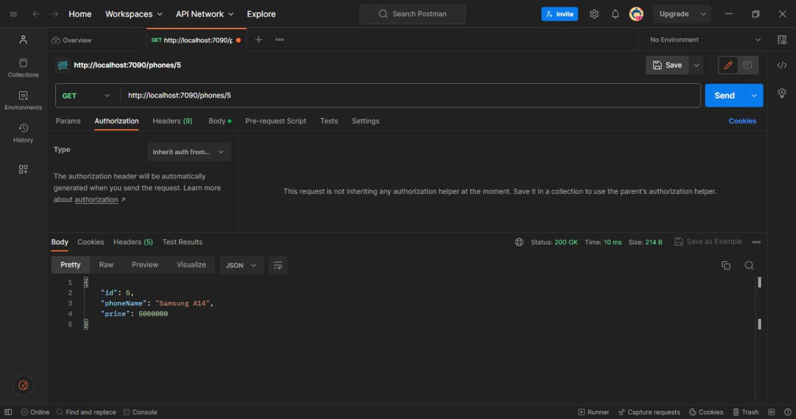
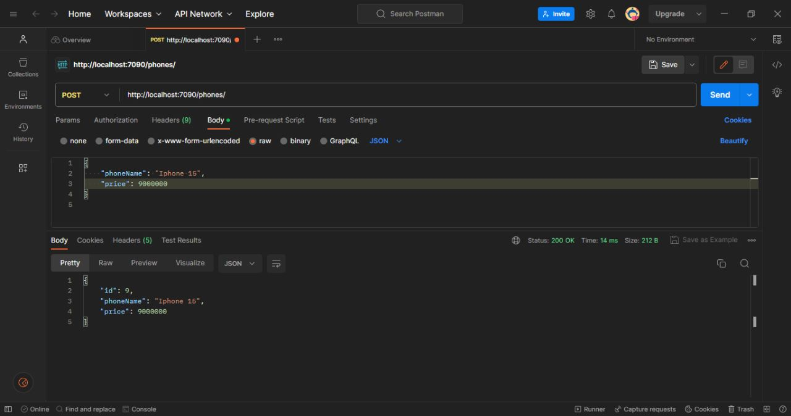

# phone-apis

  <h1>Nama : Reza Rizky Ramadhan</h1>
  <h1>NIM  : 312010469</h1>
  <h1>Kela : TI.20.D2</h1>

  <h1>Main</h1>
  

  <h1>Create</h1>
  

  <h1>Delete</h1>
  

  <h1>Upddate Data</h1>
  

  <h1>Read Data</h1>
  

  <h1>Post Man</h1>
   

  <h1>GET</h1>
  

  <h1>DELETE</h1>
  

  <h1>POST</h1>
  

  <h1>UPDATE</h1>
  

